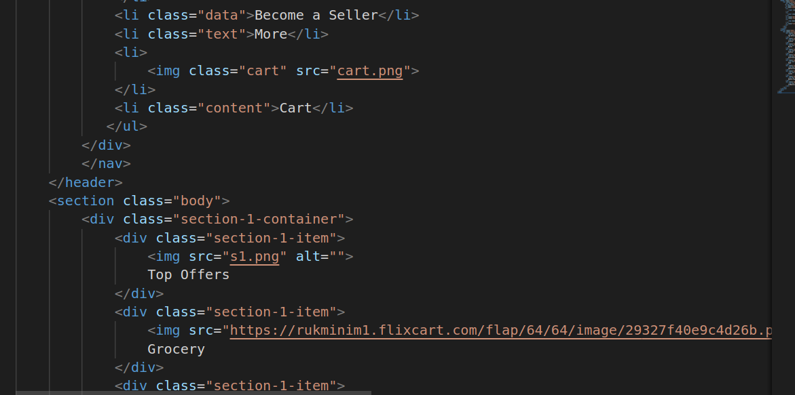
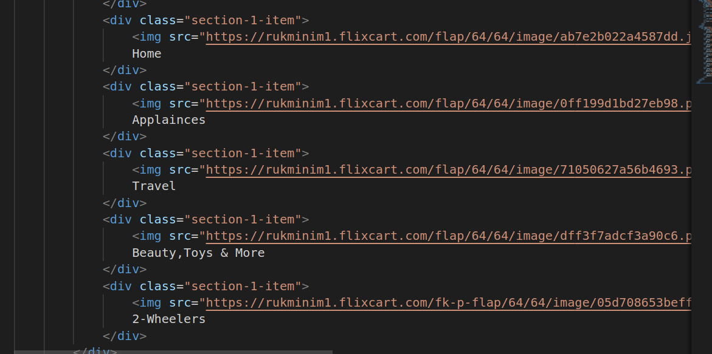
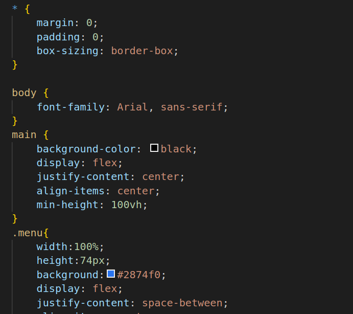
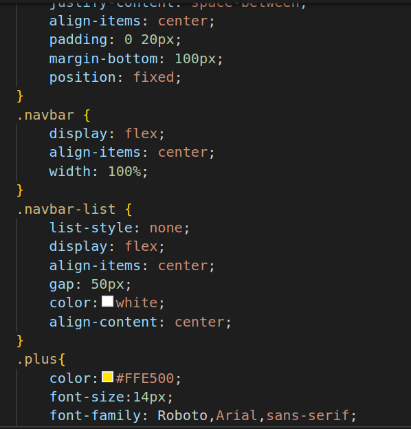
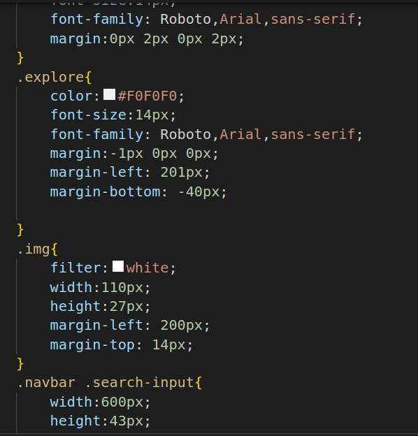
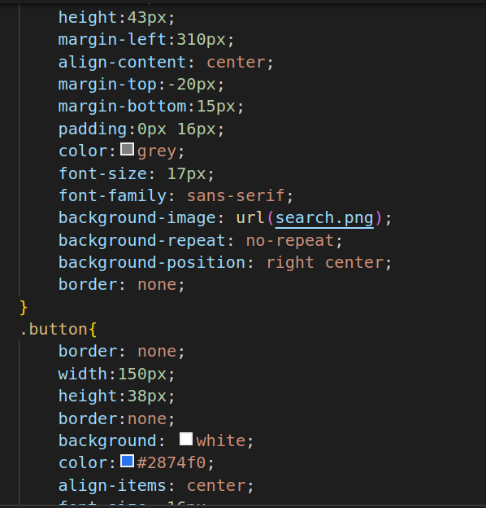
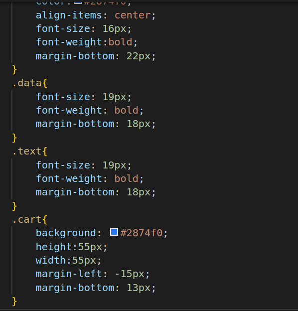
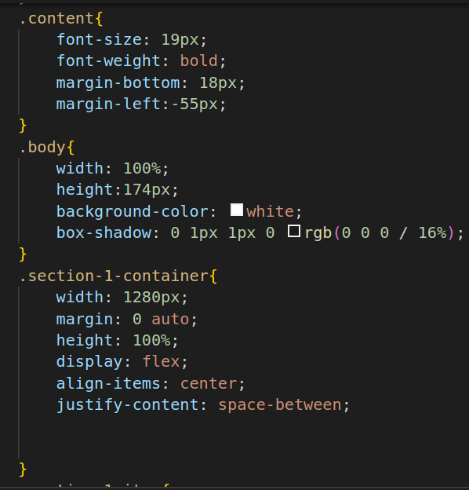
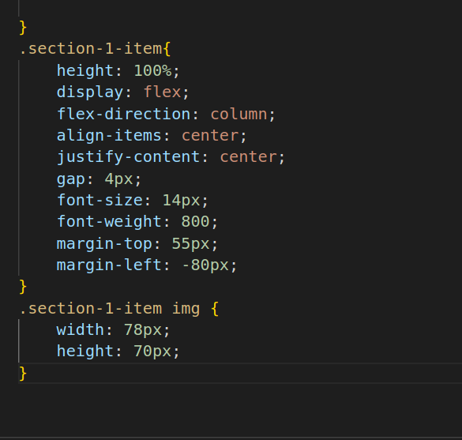

#  Flipkart Navbar
1.

2.

3.

* link:This tag is used to link an external resource to the HTML document, in this case, a CSS file named "style.css." It specifies the relationship between the current document and the linked resource (stylesheet).
* body:The body tag encloses the visible content of the HTML document, including text, images, and other elements that are displayed in the browser.
* main:The main tag is used to define the main content of the HTML document. It typically encloses the primary content that users interact with on the page.
* header:The header tag is used to define a container for introductory content or a set of navigational links. In this case, it represents the header section of the webpage, which often contains the website's logo and navigation menu.
* nav:The nav tag is used to define a section of the page that contains navigation links or menus. It is commonly used within the header to represent the website's navigation menu.
* div:The div tag is a generic container element used to group and style content. In this code, it is used to create a container for various elements within the header and other sections.
* p:The p tag is used to define paragraphs of text. It is used here to wrap the images and text in the header section.
* img:The img tag is used to display images on the webpage. It is used to show the website's logo and various icons.
* ul:The ul tag is used to define an unordered list, typically used for creating lists of items.
* li:The li tag is used within a ul In this case, it represents individual items in the navigation menu.
* input:The input tag is used to create input fields, such as text boxes and buttons. It is used for the search input field and the login button.
* section:The section tag is used to define sections within the document. In this code, it is used to define the main content section of the webpage.
* alt:The alt attribute is used within the img tag to provide alternative text for images. It is used for accessibility purposes and is displayed if the image cannot be loaded or for screen readers.

4.

* *: This is a universal selector that selects all HTML elements on the page.
margin: 0;: Sets the margin of all elements to zero.
* padding: 0: Sets the padding of all elements to zero.
* box-sizing: border-box: Ensures that the padding and border of elements are included in their total width and height calculations, preventing unexpected layout issues.
* body: Selects the body element of the HTML document.
* font-family: Arial, sans-serif: Specifies the font family to be used for text within the body. It falls back to a generic sans-serif font if Arial is unavailable.
* main: Selects the main element.
background-color: black: Sets the background color of the main element to black.
* display: flex: Makes the main element a flex container.
* justify-content: center: Horizontally centers the content within the flex container.
* align-items: center: Vertically centers the content within the flex container.

5.

6.

* min-height: 100vh: Sets a minimum height of 100% of the viewport height to ensure the content fills at least the entire viewport.
* menu: Selects the element with the class "menu."
* width: 100%: Sets the width to 100% to span the full width of its container.
* height: 74px: Sets the height of the menu to 74 pixels.
* background: #2874f0: Sets the background color to a specific shade of blue.
* display: flex: Makes the menu a flex container.
* justify-content: space-between;: Distributes the content evenly along the horizontal axis, pushing items to the edges.
* align-items: center: Vertically centers the content within the menu.
* padding: 0 20px;: Adds padding to the left and right of the menu.
* margin-bottom: 100px: Adds a margin at the bottom of the menu.
position: fixed: Fixes the menu's position, so it stays at the top of the viewport while scrolling.
* navbar: This class selector targets elements with the class "navbar."
* display: flex: Makes elements with the "navbar" class flex containers, allowing for easy horizontal alignment and spacing of child elements.
* align-items: center: Vertically centers the content within the flex container.
* width: 100%: Sets the width of elements with the "navbar" class to 100% to span the full width of their container.
* navbar-list: This class selector targets elements with the class "navbar-list."
* list-style: none;: Removes the default bullet points from lists.
display: flex;: Makes elements with the "navbar-list" class flex containers.
* align-items: center;: Vertically centers the content within the flex container.
* gap: 50px;: Adds a horizontal gap of 50 pixels between child elements.
color: white;: Sets the text color to white for elements with the "navbar-list" class.
* align-content: center;: Aligns the content within the flex container along the cross-axis (vertically) to the center.
* plus: This class selector targets elements with the class "plus."
color: #FFE500: Sets the text color to a specific shade of yellow.
* font-size: 14px: Sets the font size to 14 pixels.
* font-family: Roboto, Arial, sans-serif;: Specifies the font family for text within elements with the "plus" class.
* margin: 0px 2px 0px 2px: Sets margins for the top, right, bottom, and left sides of elements with the "plus" class, creating space around the element.
* explore: This class selector targets elements with the class "explore."
color: #F0F0F0;: Sets the text color to a specific shade of gray.
* font-size: 14px: Sets the font size to 14 pixels.
* font-family: Roboto, Arial, sans-serif: Specifies the font family for text within elements with the "explore" class.
* margin: -1px 0px 0px: Sets negative margins for the top, right, and left sides of elements with the "explore" class, adjusting the element's position.
* margin-left: 201px: Sets a left margin of 201 pixels for elements with the "explore" class, shifting the element horizontally.
* margin-bottom: -40px: Sets a negative bottom margin, further adjusting the element's position.
* img: This class selector targets elements with the class "img."
* filter: white: Applies a CSS filter to the element, in this case, setting it to "white." CSS filters can be used for effects like adjusting the color of images.
* width: 110px: Sets the width of elements with the "img" class to 110 pixels.
* height: 27px: Sets the height of elements with the "img" class to 27 pixels.
* margin-left: 200px: Adds a left margin of 200 pixels to elements with the "img" class, shifting the element horizontally.
* margin-top: 14px: Adds a top margin of 14 pixels to elements with the "img" class, moving the element down from the top.
* navbar .search-input: This selector targets elements with the class "search-input" that are descendants of elements with the class "navbar."
* width: 600px: Sets the width of elements with the "search-input" class to 600 pixels.
* height: 43px: Sets the height of elements with the "search-input" class to 43 pixels.
* margin-left: 310px: Adds a left margin of 310 pixels to elements with the "search-input" class, shifting the element horizontally.

7.

8.

* align-content: center: Aligns the content within the element along the cross-axis (vertically) to the center.
* margin-top: -20px: Adds a negative top margin, adjusting the position of the element upwards.
* margin-bottom: 15px: Adds a bottom margin of 15 pixels.
* padding: 0px 16px: Adds padding to the left and right sides of the element.
* color: grey: Sets the text color to grey.
* font-size: 17px: Sets the font size to 17 pixels.
* font-family: sans-serif: Specifies the font family for text within elements with the "search-input" class.
* background-image: url(search.png): Sets a background image for the element.
* background-repeat: no-repeat: Specifies that the background image should not be repeated.
* background-position: right center: Positions the background image to the right and vertically centered.
border: none: Removes any borders around the element.
* button: This class selector targets elements with the class "button."
* border: none: Removes borders from elements with the "button" class.
* width: 150px: Sets the width of elements with the "button" class to 150 pixels.
* height: 38px: Sets the height of elements with the "button" class to 38 pixels.
* background: white: Sets the background color of elements with the "button" class to white.
* color: #2874f0: Sets the text color to a specific shade of blue.
* align-items: center: Vertically centers the content within the element.
* font-size: 16px: Sets the font size to 16 pixels.
* font-weight: bold: Applies a bold font weight to the text within elements with the "button" class.
* margin-bottom: 22px: Adds a bottom margin of 22 pixels to create space below the element.
* data: This class selector targets elements with the class "data."
* font-size: 19px: Sets the font size to 19 pixels for elements with the "data" class.
* font-weight: bold: Applies a bold font weight to the text within elements with the "data" class.
* margin-bottom: 18px: Adds a bottom margin of 18 pixels to create space below the element. This property is often used to control the spacing between elements.
* text: This class selector targets elements with the class "text."
* font-size: 19px;: Sets the font size to 19 pixels for elements with the "text" class.
* font-weight: bold;: Applies a bold font weight to the text within elements with the "text" class.
* margin-bottom: 18px;: Adds a bottom margin of 18 pixels to create space below the element. This property is used for spacing.
* cart: This class selector targets elements with the class "cart."
* background: #2874f0: Sets the background color to a specific shade of blue (#2874f0).
* height: 55px: Sets the height of elements with the "cart" class to 55 pixels.
* width: 55px: Sets the width of elements with the "cart" class to 55 pixels.
margin-left: -15px: Adds a negative left margin of 15 pixels to shift the element to the left.
* margin-bottom: 13px: Adds a bottom margin of 13 pixels to create space below the element.
* content: This class selector targets elements with the class "content."
* font-size: 19px: Sets the font size to 19 pixels for elements with the "content" class.
* font-weight: bold: Applies a bold font weight to the text within elements with the "content" class.
* margin-bottom: 18px: Adds a bottom margin of 18 pixels to create space below the element.

9.

10.

* margin-left: -55px;: Adds a negative left margin of 55 pixels to shift the element to the left.
* body: This class selector targets elements with the class "body."
* width: 100%: Sets the width of elements with the "body" class to 100% to span the full width of their container.
* height: 174px: Sets the height of elements with the "body" class to 174 pixels.
* background-color: white;: Sets the background color to white.
* box-shadow: 0 1px 1px 0 rgb(0 0 0 / 16%);: Applies a box shadow to elements with the "body" class for a subtle shadow effect.
* section-1-container: This class selector targets elements with the class "section-1-container."
* width: 1280px;: Sets the width of elements with the "section-1-container" class to 1280 pixels.
* margin: 0 auto;: Centers the element horizontally by setting equal margins on the left and right sides.
* height: 100%;: Sets the height of elements with the "section-1-container" class to 100% to fill the height of their container.
* display: flex;: Makes elements with the "section-1-container" class flex containers.
* align-items: center;: Vertically centers the content within the flex container.
* justify-content: space-between;: Distributes the content evenly along the horizontal axis, creating space between child elements.
* section-1-item: This class selector targets elements with the class "section-1-item."
* height: 100%;: Sets the height of elements with the "section-1-item" class to 100% to fill the height of their container.
* display: flex;: Makes elements with the "section-1-item" class flex containers.
* flex-direction: column;: Arranges child elements in a column layout.
* align-items: center;: Vertically centers the content within the flex container.
* justify-content: center;: Centers the content horizontally and vertically within the flex container.
* gap: 4px;: Adds a small gap of 4 pixels between child elements.
font-size: 14px;: Sets the font size to 14 pixels for text within elements with the "section-1-item" class.
* font-weight: 800;: Applies a font weight of 800 (typically a bold weight) to the text within elements with the "section-1-item" class.
* margin-top: 55px;: Adds a top margin of 55 pixels to create space above the element.
margin-left: -80px;: Adds a negative left margin of 80 pixels to shift the element to the left.
* section-1-item img: This selector targets images within elements with the class "section-1-item."
* width: 78px: Sets the width of images inside elements with the "section-1-item" class to 78 pixels.
* height: 70px: Sets the height of images inside elements with the "section-1-item" class to 70 pixels.

